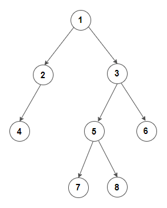

# DS-Algos
> # Algorithms and Datastructures
1. [Substring In a String](#substring-in-a-string)
2. [Tree Traversal](#tree-traversal)
3. [Binary Tree](#binary-tree)
4. [Binary Search Tree](#binary-search-tree)
5. [Mixed Questions](#mixed-questions)
6. [Graphs](#graphs)
7. [Dynamic Programming](#dynamic-programming)
**********************************************************************************

## Substring In a String
- [KMP Algorithm](./KMPAlgorithm.java)

**********************************************************************************

## Tree Traversal
- Inorder Traversal
- Preorder Traversal
- Postorder Traversal
- [Top View of a Binary Tree](#top-view-of-binary-tree)
- [Bottom View of a Binary Tree](#bottom-view-of-binary-tree)
- [Left View of a Binary Tree](#left-view-of-binary-tree)
- [Right View of a Binary Tree](#right-view-of-binary-tree)
- [Level Order Traversal](#level-order-traversal)
- [Level Order Traversal Spiral](#level-order-traversal-spiral)
- [Height of a Binary Tree](#height-of-binary-tree)
- [Diameter of a Binary Tree](#diameter-of-binary-tree)
- [Binary Tree Height balanced or not](#how-to-determine-if-a-binary-tree-is-height-balanced-or-not)
- [Lowest Common Ancestor(LCA) of a Binary Tree](#lowest-common-ancestor-of-binary-tree)
- [Check if two trees are Identical or not](#check-if-two-trees-are-identical)

**********************************************************************************

## Binary Tree
- [Maximum Path Sum in a Binary Tree](#maximum-path-sum-in-binary-tree)
- [Constructing Binary Tree using Inorder and Preorder Traversal](#constructing-binary-tree-using-inorder-and-preorder-traversal)
- [Constructing Binary Tree using Inorder and Postorder Traversal](#constructing-binary-tree-using-inorder-and-postorder-traversal)
- [Symmetric Binary Tree](#symmetric-binary-tree)
- [Check If Binary Tree Is Mirror Of Itself](#check-if-binary-tree-is-mirror-of-itself)
- [Flatten a Binary Tree into a LinkedList](#flatten-binary-tree-into-a-linkedlist)

**********************************************************************************

## Binary Search Tree
- [Populate Next Right Pointers](#populate-next-right-pointers-of-tree-using-constant-extra-space)
- [Search Given Key in Binary Search Tree Recursive and Iterative](#search-given-key-in-binary-search-tree-recursive-and-iterative)
- [Construct a Balanced Binary Search Tree Using given Keys](#construct-balanced-binary-search-tree-using-given-keys)
- [Check is Binary Tree a Binary Search Tree or Not](#check-is-binary-tree-a-binary-search-tree-or-not)
___
- [Lowest Common Ancestor(LCA) of a Binary Search Tree](./Practice/LCAofBST.java)
- [Find the inorder predecessor & successor of a given Key in a Binary Search Tree(BST)](./Practice/InorderPreSucOfAGivenKeyInBST.java)
- [Floor](./Practice/FloorInaBST.java) and [Ceil](./Practice/CeilInaBST.java) in a Binary Search Tree(BST)
- [Kth Smallest element in a Binary Search Tree(BST)](./Practice/KthSmallestInABST.java)
- [Kth Largest element in a Binary Search Tree(BST)](./Practice/KthLargestInABST.java)
- [Find a Pair with a Given Sum in Binary Search Tree(BST)](./Practice/FindAPairWithAGivenSumInBST.java)
- [Binary Search Tree(BST) iterator](./Practice/BSTIterator.java)
- [Size of the largest Binary Search Tree(BST) in a Binary Tree](./Practice/SizeOfLargestBSTInBT.java)
- [Serialize and deserialize Binary Tree](./Practice/SerializeDeserializeABinaryTree.java)

**********************************************************************************

## Mixed Questions
- [Binary Tree to Double Linked List](./Practice/BTtoDLL.java)
- [Find median in a stream of running integers](./Practice/FindMedianInAStreamOfRunningIntegers.java)
- [K-th largest element in a stream](./Practice/KthLargestElementInAStream.java)
- [Distinct numbers in Window](./Practice/DistinctNumbersInAWindow.java)
- [K-th largest element in an unsorted array](./Practice/KthLargestElementInUnsortedArray.java)
- [Flood-fill Algorithm](./Practice/FloodFillAlgorithm.java)

**********************************************************************************
->***Work in Progress***<-
## Graphs
- Clone a graph (Not that easy as it looks)
- DFS
- BFS
- Detect A cycle in Undirected Graph/Directed Graph
- Topo Sort
- Number of islands (Do in Grid and Graph both)
- Bipartite Check
- SCC(using KosaRaju’s algo)
- Djisktra’s Algorithm
- Bellman Ford Algo
- Floyd Warshall Algorithm
- MST using Prim’s Algo
- MST using Kruskal’s Algo

**********************************************************************************

## Dynamic Programming
- Max Product Subarray
- Longest Increasing Subsequence
- Longest Common Subsequence
- 0-1 Knapsack
- Edit Distance
- Maximum sum increasing subsequence
- Matrix Chain Multiplication
- Maximum sum path in matrix, (count paths, and similar type do, also backtrack to find the maximum path)
- Coin change
- Subset Sum
- Rod Cutting
- Egg Dropping
- Word Break
- Palindrome Partitioning (MCM Variation)

**********************************************************************************

#### Top View of Binary Tree

Top view of a binary tree is the set of nodes visible when the tree is viewed from the top. Given a binary tree, print the top view of it. The output nodes can be printed in any order.

A node x is there in output if x is the topmost node at its horizontal distance. Horizontal distance of left child of a node x is equal to horizontal distance of x minus 1, and that of right child is horizontal distance of x plus 1.

          1
       /     \
      2       3
     /  \    / \
    4    5  6   7
Top view of the above binary tree is
4 2 1 3 7

        1
      /   \
    2       3
      \   
        4  
          \
            5
             \
               6
Top view of the above binary tree is
2 1 3 6

[Go to Top](#tree-traversal)
**********************************************************************************

#### Bottom View of Binary Tree

Given a Binary Tree, we need to print the bottom view from left to right. A node x is there in output if x is the bottommost node at its horizontal distance. Horizontal distance of left child of a node x is equal to horizontal distance of x minus 1, and that of right child is horizontal distance of x plus 1.

Examples:

                      20
                    /    \
                  8       22
                /   \      \
              5      3      25
                    / \      
                  10    14

For the above tree the output should be 5, 10, 3, 14, 25.

If there are multiple bottom-most nodes for a horizontal distance from root, then print the later one in level traversal. For example, in the below diagram, 3 and 4 are both the bottom-most nodes at horizontal distance 0, we need to print 4.

                   
                      20
                    /    \
                  8       22
                /   \    /   \
              5      3 4     25
                    / \      
                  10    14 
For the above tree the output should be 5, 10, 4, 14, 25.

[Solution](./TreeBottomView.java)

[Go to Top](#tree-traversal)
**********************************************************************************

#### Left View of Binary Tree

Given a Binary Tree, print left view of it. Left view of a Binary Tree is set of nodes visible when tree is visited from left side.

Examples:

Input : 

                 1
               /   \
              2     3
             / \     \
            4   5     6             
Output : 1 2 4

Input :

        1
      /   \
    2       3
      \   
        4  
          \
            5
             \
               6
Output :1 2 4 5 6

[Solution](./TreeLeftView.java)

[Go to Top](#tree-traversal)

**********************************************************************************

#### Right View of Binary Tree

Given a Binary Tree, print Right view of it. Right view of a Binary Tree is set of nodes visible when tree is visited from Right side.
Right view of following tree is 1 3 7 8

           1
        /     \
       2        3
     /   \     /  \
    4     5   6    7
                    \
                     8

[Solution](./TreeRightView.java)

[Go to Top](#tree-traversal)

**********************************************************************************

#### Level Order Traversal Spiral

Level order traversal of a tree is breadth first traversal for the tree.

            1
          /   \
        2       3
      /   \
    4       5

Level order traversal of the above tree is 1 2 3 4 5

[Solution](./Practice/LevelOrderTraversalSpiral.java)

[Go to Top](#tree-traversal)

**********************************************************************************

#### Right View of Binary Tree

Write a function to print spiral order traversal of a tree. For below tree, function should print 1, 2, 3, 4, 5, 6, 7.

                  1
                /   \
              2      3
            /   \   /  \
          7     6   5   4

[Solution](./TreeRightView.java)

[Go to Top](#tree-traversal)

**********************************************************************************

#### Height of Binary Tree

Given a binary tree, find height of it. Height of empty tree is 0 and height of below tree is 3.

           1
         /   \
        2     3
       / \
      4   5

[Solution](./Practice/HeightOfBinaryTree.java)

[Go to Top](#tree-traversal)

**********************************************************************************

#### Diameter of Binary Tree

The diameter of a tree (sometimes called the width) is the number of nodes on the longest path between two end nodes. The diagram below shows two trees each with diameter nine, the leaves that form the ends of a longest path are shaded (note that there is more than one path in each tree of length nine, but no path longer than nine nodes).

[Solution](./Practice/DiameterOfBinaryTree.java)

[Go to Top](#tree-traversal)

**********************************************************************************

#### How to determine if a binary tree is height balanced or not?

A tree where no leaf is much farther away from the root than any other leaf. Different balancing schemes allow different definitions of “much farther” and different amounts of work to keep them balanced.
Consider a height-balancing scheme where following conditions should be checked to determine if a binary tree is balanced.
An empty tree is height-balanced. A non-empty binary tree T is balanced if:
1) Left subtree of T is balanced
2) Right subtree of T is balanced
3) The difference between heights of left subtree and right subtree is not more than 1.

The above height-balancing scheme is used in AVL trees. The diagram below shows two trees, one of them is height-balanced and other is not. The second tree is not height-balanced because height of left subtree is 2 more than height of right subtree.

[Solution](./Practice/BinaryTreeBalancedOrNot.java)

[Go to Top](#tree-traversal)

**********************************************************************************

#### Lowest Common Ancestor of Binary Tree

Given a binary tree (not a binary search tree) and two values say n1 and n2, write a program to find the least common ancestor.
Following is definition of LCA from Wikipedia:
Let T be a rooted tree. The lowest common ancestor between two nodes n1 and n2 is defined as the lowest node in T that has both n1 and n2 as descendants (where we allow a node to be a descendant of itself).

The LCA of n1 and n2 in T is the shared ancestor of n1 and n2 that is located farthest from the root. Computation of lowest common ancestors may be useful, for instance, as part of a procedure for determining the distance between pairs of nodes in a tree: the distance from n1 to n2 can be computed as the distance from the root to n1, plus the distance from the root to n2, minus twice the distance from the root to their lowest common ancestor.

[Solution](./Practice/LCA.java)

[Go to Top](#tree-traversal)

**********************************************************************************

#### Check if two trees are Identical

Two trees are identical when they have same data and arrangement of data is also same.
To identify if two trees are identical, we need to traverse both trees simultaneously, and while traversing we need to compare data and children of the trees.

[Solution](./Practice/IdenticalTrees.java)

[Go to Top](#tree-traversal)

**********************************************************************************

### Binary Tree

#### Maximum Path Sum in Binary Tree

Given a binary tree, find the maximum path sum. The path may start and end at any node in the tree.

Example:

Input: Root of below tree

       1
      / \
     2   3
Output: 6

See below diagram for another example.
1+2+3

[Solution](./Practice/MaximumPathSum.java)

[Go to Top](#binary-tree)

**********************************************************************************

#### Constructing Binary Tree using Inorder and Preorder Traversal

Write an efficient algorithm to construct a binary tree from given inorder and preorder sequence.

For example,

Input:
 
Inorder Traversal:  { 4, 2, 1, 7, 5, 8, 3, 6 }
Preorder Traversal: { 1, 2, 4, 3, 5, 7, 8, 6 }
 
 
Output: Below binary tree

[Solution](./Practice/BinaryTreeUsingPreOrderAndInOrder.java)

[Optimised Solution](./Practice/BinaryTreeUsingPreOrderAndInOrderOptimized.java)

[Go to Top](#binary-tree)

**********************************************************************************

#### Constructing Binary Tree using Inorder and Postorder Traversal

Given Postorder and Inorder traversals, construct the tree.

Examples:

Input : 
in[]   = {2, 1, 3}
post[] = {2, 3, 1}

Output : Root of below tree

        1
      /   \
     2     3 

Input : 
in[]   = {4, 8, 2, 5, 1, 6, 3, 7}
post[] = {8, 4, 5, 2, 6, 7, 3, 1} 

Output : Root of below tree

             1
          /      \
         2        3
       /   \    /   \
      4     5  6     7
        \
         8

[Solution](./Practice/BinaryTreeUsingPostOrderAndInOrder.java)

[Go to Top](#binary-tree)

**********************************************************************************

# Symmetric Binary Tree

Given a binary tree, check whether it is a mirror of itself.

For example, this binary tree is symmetric:

           1
         /   \
        2     2
       / \   / \
      3   4 4   3
But the following is not:

      1
     / \
    2   2
     \   \
     3    3

[Solution](./Practice/SymmetricBinaryTree.java)

[Go to Top](#binary-tree)

**********************************************************************************

# Check if Binary Tree is Mirror of Itself

Given a binary tree, check whether it is a mirror of itself.

For example, this binary tree is symmetric:

           1
         /   \
        2     2
       / \   / \
      3   4 4   3
But the following is not:

      1
     / \
    2   2
     \   \
     3    3

[Solution](./Practice/CheckIfBinaryTreeIsMirrorOfItself.java)

[Go to Top](#binary-tree)

**********************************************************************************

# Flatten Binary Tree Into a LinkedList

Given a binary tree, flatten it to a linked list in-place.

For example, given the following tree:

            1
           / \
          2   5
         / \   \
        3   4   6
The flattened tree should look like:

        1
         \
          2
           \
            3
             \
              4
               \
                5
                 \
                  6
[Solution](./Practice/FlattenABinaryTreeIntoLinkedList.java)

[Go to Top](#binary-tree)

**********************************************************************************
### Binary Search Tree

#### Populate Next Right Pointers of Tree using constant extra space

Write a function to connect all the adjacent nodes at the same level in a binary tree. Structure of the given Binary Tree node is like following.

    struct node { 
      int data; 
      struct node* left; 
      struct node* right; 
      struct node* nextRight; 
    } 
Initially, all the nextRight pointers point to garbage values. Your function should set these pointers to point next right for each node. You can use only constant extra space.

Example:

Input Tree

         A
        / \
       B   C
      / \   \
     D   E   F

Output Tree

         A--->NULL
        / \
       B-->C-->NULL
      / \   \
     D-->E-->F-->NULL

[Solution](./Practice/NextRightPointersOfATree.java)

[Go to Top](#binary-search-tree)

**********************************************************************************
#### Search Given Key in Binary Search Tree Recursive and Iterative

[Recursive Solution](./Practice/SearchGivenKeyInBSTRecursive.java)

[Iterative Solution](./Practice/SearchGivenKeyInBSTIterative.java)

[Go to Top](#binary-search-tree)

**********************************************************************************

#### Construct Balanced Binary Search Tree Using given Keys

Given an unsorted array of integers which represents binary search tree keys, construct a height balanced BST from it.

[Solution](./Practice/ConstructABalancedBSTUsingGivenKeys.java)

[Go to Top](#binary-search-tree)

**********************************************************************************

#### Check is Binary Tree a Binary Search Tree or Not

A binary search tree (BST) is a node based binary tree data structure which has the following properties.
• The left subtree of a node contains only nodes with keys less than the node’s key.
• The right subtree of a node contains only nodes with keys greater than the node’s key.
• Both the left and right subtrees must also be binary search trees.

From the above properties it naturally follows that:
• Each node (item in the tree) has a distinct key.

[Solution](./Practice/CheckIsBTaBSTorNot.java)

[Go to Top](#binary-search-tree)

**********************************************************************************
